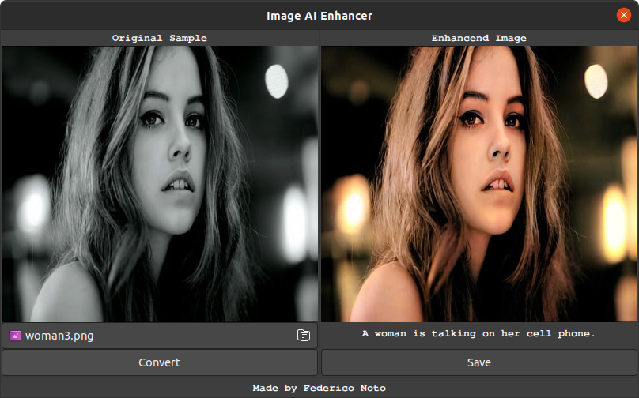

# Image AI Enhancer
An open source application made in Python. Allows you to enhance a grayscaled image with artificial intelligence.

---



---

### Builds
| Latest release | Latest development build |
|----------------|--------------------------|
| [](https://github.com/NotoFederico/ImageAIEnhancer/tree/main) | [](https://github.com/NotoFederico/ImageAIEnhancer/tree/dev) |

---

# Contents
- 1 - [Introduction](#1-introduction)
- 2 - [Building the game](#2-building-the-game)
  - 2.1 - [Building prerequisites](#21-building-prerequisites)
  - 2.2 - [Compiling and running](#22-compiling-and-running)
- 3 - [Contributing](#3-contributing)
- 4 - [Licence](#4-licence)

---

# 1. Introduction

**Image AI Enhancer** is a open source application made in Python. The program allows you to select a .png or .jpg image file, convert it, and view both the original image and the enhanced image next to each other. The conversion process uses the DeepAI API where four processes take place: 

1. [Colorization](https://deepai.org/api-docs/#image-colorization "Colorization")
2. [Super Resolution](https://deepai.org/api-docs/#super-resolution "Super Resolution")
3. [Neural Talk](https://deepai.org/api-docs/#neural-talk-2 "Neural Talk 2")
4. [Waifu2x](https://deepai.org/machine-learning-model/waifu2x "Waifu2x")

The resulting file can then be saved in a directory and file name of the user's choice.

---

# 2. Building the application

## 2.1 Building prerequisites

You need python for either operative system. Get it from https://www.python.org/downloads/

### Windows
1. Go to http://www.msys2.org/ and download the x86_64 installer
2. Follow the instructions on the page for setting up the basic environment
3. Run C:\msys64\mingw64.exe - a terminal window should pop up
4. Execute pacman -Suy
5. Execute pacman -S mingw-w64-x86_64-gtk3 mingw-w64-x86_64-python3 mingw-w64-x86_64-python3-gobject
6. Execute pacman -S mingw-w64-x86_64-python-requests
7. Use cd command to go to the local path folder where you cloned the repository
8. Execute python main.py

### GNU/Linux
None

---

## 2.2 Compiling and running

### Windows
1. Run C:\msys64\mingw64.exe - a terminal window should pop up
2. Use cd command to go to the local path folder where you cloned the repository
3. Execute python main.py

### GNU/Linux
1. Open a terminal in the local path folder where you cloned the repository
2. Execute python main.py

---

# 3. Contributing

Pong Gmae uses the [gitflow workflow](https://www.atlassian.com/git/tutorials/comparing-workflows#gitflow-workflow). If you are implementing a new feature or logic from the original game, please branch off and perform pull requests to ```develop```. If you are fixing a bug for the next release, please branch off and perform pull requests to the correct release branch. ```master``` only contains tagged releases, you should never branch off this.

---
# 4. Licence

Image AI Enhancer is licensed under the GNU General Public License version 3.

